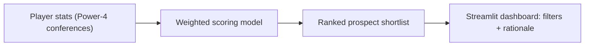

> **Deployable Streamlit decision-support tool** that ranks prospects via a transparent weighted-scoring model — analogous to lead scoring, vendor selection, or talent analytics.

# D1 Baseball Recruitment Dashboard

## How it works



A comprehensive recruitment tool for scouting Division 1 college baseball players from Power 4 conferences. This dashboard identifies top prospects who have not been drafted in the MLB Draft, ranking them based on specific performance criteria.

## Features

- **30 Starting Pitchers** - Ranked by strike rate (BB/9), ERA, K/9 (velocity proxy), and WHIP
- **15 Relief Pitchers** - Ranked by K/9 (stuff), ERA, WHIP, and usage pattern
- **50 Hitters** - Ranked by K:BB ratio, wRC+, wOBA, OBP, SLG, and OPS
- **MLB Draft Filter** - Automatically excludes players who have been drafted
- **Power 4 Conference Focus** - SEC, ACC, Big Ten, and Big 12
- **Interactive Filters** - Filter by conference, tier, and more
- **Player Explanations** - Contextual analysis for each player's ranking

## Installation

### Prerequisites

- Python 3.10 or higher
- pip package manager

### Setup

1. Clone or download this project:
```bash
cd "D1 Recruitment"
```

2. Create a virtual environment (recommended):
```bash
python -m venv venv
source venv/bin/activate  # On Windows: venv\Scripts\activate
```

3. Install dependencies:
```bash
pip install -r requirements.txt
```

4. (Optional) Install the collegebaseball package for advanced metrics:
```bash
pip install git+https://github.com/nathanblumenfeld/collegebaseball.git
```

## Usage

### Running the Dashboard

```bash
streamlit run app.py
```

This will start the dashboard and open it in your default web browser at `http://localhost:8501`.

### Refreshing Data

Click the "🔄 Refresh Data" button in the sidebar to fetch fresh data from NCAA sources.

## Ranking Criteria

### Starting Pitchers
| Metric | Weight | Priority |
|--------|--------|----------|
| BB/9 (Strike Rate) | 40% | **Most Important** - We want strike throwers |
| ERA | 25% | Run prevention ability |
| K/9 | 20% | Velocity proxy - ability to miss bats |
| WHIP | 15% | Overall effectiveness |

### Relief Pitchers
| Metric | Weight | Priority |
|--------|--------|----------|
| K/9 | 40% | **Most Important** - Swing-and-miss stuff |
| ERA | 30% | Run prevention |
| WHIP | 20% | Effectiveness |
| IP/App | 10% | Usage pattern identifier |

### Hitters
| Metric | Weight | Priority |
|--------|--------|----------|
| K:BB Ratio | 35% | **Most Important** - Plate discipline |
| wRC+ | 20% | Overall offensive value |
| wOBA | 15% | Weighted offensive contribution |
| OBP | 15% | On-base ability |
| SLG | 10% | Power |
| OPS | 5% | Combined on-base + power |

## Power 4 Conferences

The dashboard focuses on these premier conferences:

- **SEC** - Alabama, Arkansas, Auburn, Florida, Georgia, Kentucky, LSU, Mississippi State, Missouri, Ole Miss, South Carolina, Tennessee, Texas A&M, Vanderbilt
- **ACC** - Boston College, Clemson, Duke, Florida State, Georgia Tech, Louisville, Miami, NC State, North Carolina, Notre Dame, Pittsburgh, Syracuse, Virginia, Virginia Tech, Wake Forest
- **Big Ten** - Illinois, Indiana, Iowa, Maryland, Michigan, Michigan State, Minnesota, Nebraska, Northwestern, Ohio State, Penn State, Purdue, Rutgers, Wisconsin
- **Big 12** - Arizona, Arizona State, Baylor, BYU, Cincinnati, Colorado, Houston, Iowa State, Kansas, Kansas State, Oklahoma State, TCU, Texas Tech, UCF, Utah, West Virginia

## Project Structure

```
D1 Recruitment/
├── app.py                    # Main Streamlit dashboard
├── config.py                 # Configuration and weights
├── requirements.txt          # Python dependencies
├── README.md                 # This file
├── src/
│   ├── __init__.py
│   ├── data_collection.py    # NCAA data fetching
│   ├── draft_filter.py       # MLB draft exclusion
│   ├── metrics.py            # Metric calculations
│   ├── ranking.py            # Weighted ranking algorithm
│   ├── explanations.py       # Player explanation generator
│   └── utils.py              # Utility functions
└── data/
    ├── raw/                  # Raw data cache
    ├── processed/            # Processed data
    └── cache/                # API response cache
```

## Customization

### Adjusting Weights

Edit `config.py` to modify the ranking weights:

```python
STARTING_PITCHER_WEIGHTS = {
    "bb_per_9": 0.40,  # Adjust these values
    "era": 0.25,
    "k_per_9": 0.20,
    "whip": 0.15
}
```

### Changing Player Counts

```python
NUM_STARTING_PITCHERS = 30  # Change to show more/fewer
NUM_RELIEF_PITCHERS = 15
NUM_HITTERS = 50
```

### Minimum Qualification Thresholds

```python
MIN_IP_STARTER = 40.0      # Minimum innings for starters
MIN_IP_RELIEVER = 15.0     # Minimum innings for relievers
MIN_PA_HITTERS = 100       # Minimum plate appearances
```

## Deployment

### Streamlit Cloud

1. Push the project to a GitHub repository
2. Go to [share.streamlit.io](https://share.streamlit.io)
3. Connect your GitHub account
4. Select the repository and `app.py` as the main file
5. Deploy

### Local Network

To make the dashboard accessible on your local network:

```bash
streamlit run app.py --server.address 0.0.0.0
```

## Data Sources

The dashboard uses multiple data sources:

1. **ncaa_bbStats** - Primary source for NCAA statistics and MLB draft data
2. **collegebaseball (SportsDataverse)** - Supplementary source for advanced metrics
3. **Sample Data** - Fallback realistic data for development/testing

Note: When live data sources are unavailable, the dashboard will use realistic sample data that simulates actual player statistics.

## Velocity Proxy

Since pitch velocity data is not publicly available in NCAA statistics (it requires proprietary Trackman/Synergy data), we use **K/9 (strikeouts per 9 innings)** as a proxy for arm strength:

- High K/9 indicates ability to overpower hitters
- Combined with low BB/9, suggests power arm with control
- This approach allows meaningful ranking without proprietary data

## Contributing

Feel free to submit issues or pull requests to improve the dashboard.

## License

This project is for educational and recruitment purposes. Please respect NCAA and data source terms of service when using this tool.

